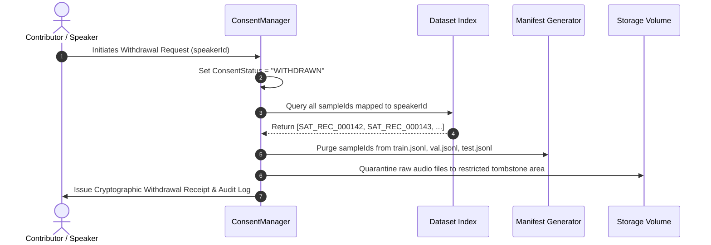

# Bhasha Setu — Santali Speech Dataset Ethical Consent & Withdrawal Protocol

**Document Version:** 1.0.0  
**Framework:** Indigenous Data Sovereignty, CARE & FAIR Principles  
**Status:** Mandatory Production Compliance Standard  
**Date:** September 2026  

---

## 1. Ethical Governance & Indigenous Data Sovereignty

Speech data represents personal identity, cultural heritage, and linguistic knowledge. Bhasha Setu firmly adheres to the **CARE Principles for Indigenous Data Governance** (Collective Benefit, Authority to Control, Responsibility, Ethics) and rejects extractive data harvesting.

> [!CRITICAL]
> **Consent Mandate:**  
> Every voice sample ingested into Bhasha Setu's speech corpus must be backed by a verified, signed, and unrevoked **Informed Consent Record**. Speech recorded without documented consent will be **hard-blocked** by the dataset compiler and deleted.

---

## 2. Multi-Tier Permission Hierarchy

Consent is not a monolithic boolean. Bhasha Setu establishes four distinct permission tiers:

| Permission Field | Purpose & Legal Scope | Default Value | Can Speaker Opt-Out? |
| :--- | :--- | :---: | :---: |
| **`modelTrainingPermission`** | Grants permission to compute acoustic features, train neural TTS backbones, and deploy synthetic voices. | `true` (Mandatory for TTS) | Yes (Withdrawal supported) |
| **`researchPermission`** | Grants permission for academic and linguistic analysis of Santali phonology. | `true` | Yes |
| **`commercialUsePermission`** | Grants permission for integration into commercial products or enterprise systems. | `false` | Yes (Explicit opt-in required) |
| **`redistributionPermission`** | Grants permission to openly publish raw audio recordings on public repositories (e.g. Hugging Face). | `false` | Yes (Explicit opt-in required) |

---

## 3. Consent Record Schema

```json
{
  "consentId": "CNS_SAT_2026_004",
  "speakerId": "SAT_SPK_004",
  "datasetId": "santali-tts",
  "purpose": "Acoustic recording for Bhasha Setu native Santali TTS training and educational speech assistance",
  "recordingDate": "2026-09-15T10:30:00Z",
  "permissionScope": "FULL_VOICE_MODEL",
  "commercialUsePermission": false,
  "modelTrainingPermission": true,
  "redistributionPermission": false,
  "withdrawalPolicy": "Permanent unconditional right of withdrawal within 30 days of session completion",
  "consentVersion": "2.0-tribal-community",
  "status": "ACTIVE"
}
```

---

## 4. Cascading Speaker Withdrawal Protocol

Every contributor maintains an unconditional right to withdraw their voice data at any time prior to model weight compilation.



### Withdrawal Execution Guarantees
1. **Zero Sample Leakage:** The `ConsentManager.withdrawSpeakerConsent()` engine automatically identifies 100% of samples attributed to the speaker ID.
2. **Review Status Mutation:** Affected samples are instantaneously flipped to `reviewStatus: "REJECTED"` and `consentStatus: "WITHDRAWN"`.
3. **Training Block:** Any dataset build containing even a single withdrawn sample ID is halted with exit code 1 by the `validate-santali-dataset` compliance gate.
4. **Audit Trail:** An immutable JSON log is written recording:
   - `speakerId`
   - `consentId`
   - `timestamp`
   - `revokedSampleCount`
   - `revokedSampleIds`
