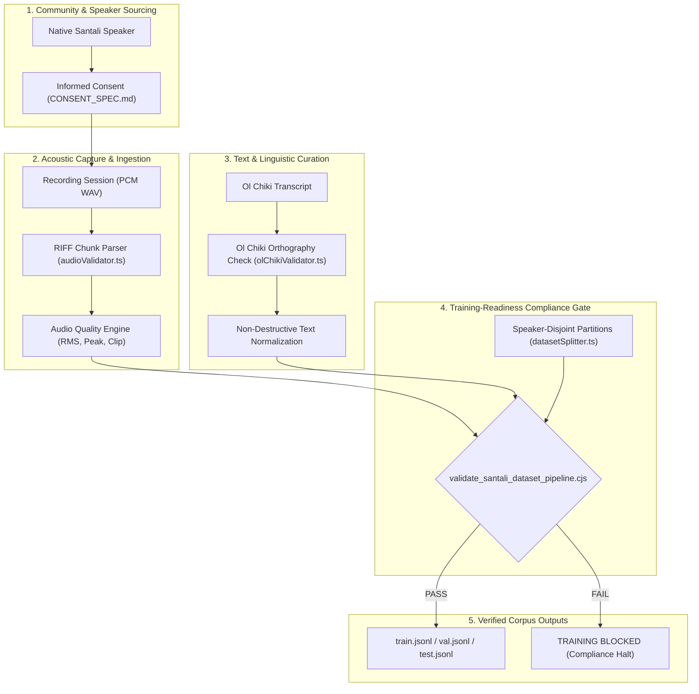

# Bhasha Setu — Santali Speech Dataset & Recording Pipeline

**Corpus ID:** `santali-tts-v0`  
**Version:** `v0.1.0-specification`  
**Status:** Canonical Dataset Architecture & Protocol Standard  
**Target Language:** Santali (`sat`, `sat-Olck`)  
**Target Script:** Ol Chiki (`U+1C50 - U+1C7F`)  
**Phase:** Phase 8 — Data Infrastructure & Recording Pipeline  

---

## Executive Overview

Following the conclusions of **Phase 7 (TTS Model Research & Benchmark)**, no currently audited off-the-shelf neural TTS model satisfies Bhasha Setu's standards for linguistic accuracy, Ol Chiki native tokenization, legal safety, and offline edge performance.

To overcome this structural barrier, **Phase 8 establishes the foundational data and recording infrastructure** required to construct a genuine, ethically consented, studio-quality Santali speech corpus.

> [!IMPORTANT]
> **Core Operating Principles:**
> 1. **Zero Fabricated Data:** Synthetic audio or machine-translated transcripts are never masqueraded as native human speech.
> 2. **Informed Multi-Tier Consent:** Speakers retain sovereignty with dedicated training, research, commercial, and redistribution permissions, backed by an automated cascading withdrawal mechanism.
> 3. **Non-Destructive Normalization:** Raw acoustic captures and original transcripts are archived alongside normalized artifacts.
> 4. **Speaker-Disjoint Partitions:** Train, Validation, and Test sets strictly isolate speaker identities to prevent overfitting and data leakage.
> 5. **Training-Readiness Gate:** A strict compliance gate halts model training if consent, acoustic integrity, or speaker partitions fail validation.

---

## Document Index

| Document | Purpose |
| :--- | :--- |
| [DATASET_SPEC.md](file:///d:/SIH/docs/tts-dataset/santali/DATASET_SPEC.md) | Technical schema, versioning, directory layout, and metadata fields |
| [CONSENT_SPEC.md](file:///d:/SIH/docs/tts-dataset/santali/CONSENT_SPEC.md) | Multi-tier ethical consent framework, privacy constraints, and withdrawal workflow |
| [RECORDING_GUIDELINES.md](file:///d:/SIH/docs/tts-dataset/santali/RECORDING_GUIDELINES.md) | Acoustic room setup, accessible microphone categories, gain staging, and session protocols |
| [TRANSCRIPTION_GUIDELINES.md](file:///d:/SIH/docs/tts-dataset/santali/TRANSCRIPTION_GUIDELINES.md) | Verification states, Ol Chiki orthography, diacritic attachment rules, and Roman handling |
| [QUALITY_GUIDELINES.md](file:///d:/SIH/docs/tts-dataset/santali/QUALITY_GUIDELINES.md) | Deterministic audio quality thresholds (clipping, silence, peak, RMS, noise floor) |
| [DIALECT_GUIDELINES.md](file:///d:/SIH/docs/tts-dataset/santali/DIALECT_GUIDELINES.md) | Documented dialect classifications (Mayurbhanj, Northern, etc.) without taxonomical invention |
| [EVALUATION_PROTOCOL.md](file:///d:/SIH/docs/tts-dataset/santali/EVALUATION_PROTOCOL.md) | Double-blind native-speaker evaluation methodology and Likert scoring rules |
| [SANTALI_TTS_DATASET_CARD.md](file:///d:/SIH/docs/tts-dataset/santali/SANTALI_TTS_DATASET_CARD.md) | Machine-readable dataset card, curation details, and licensing boundaries |

---

## Architectural Flow

---

## Current Operational Baseline

While Phase 8 data collection protocols are underway, Bhasha Setu continues to serve end-users via the **Phonetic Speech Bridge** (`Ol Chiki -> Linguistic Diacritic Normalizer -> Verified Phrase/Lexicon Engine -> Syllable-Aware Roman Phonetic Bridge -> Indian Acoustic Voice`). The Text-to-Speech user interface remains **100% frozen** with zero disruption.
