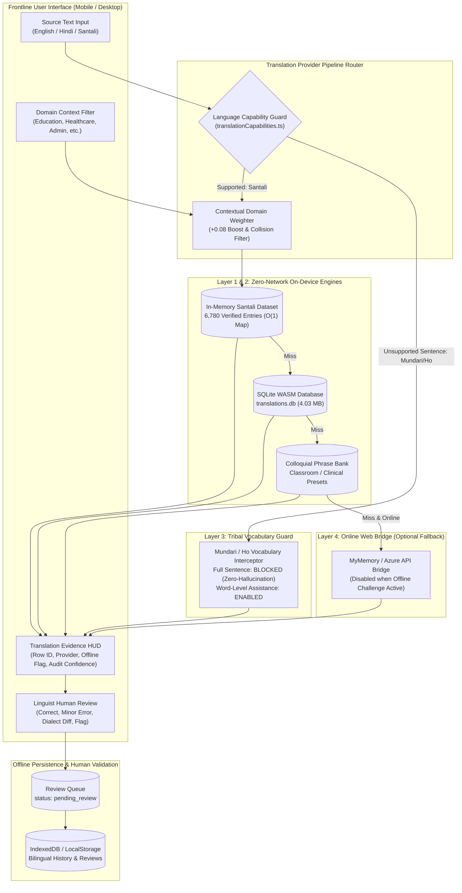

# Bhasha Setu (भाषा | SETU) — Phase 4 Comprehensive Evidence Package
**Linguistic Accuracy • Real-World Validation • SIH Evidence Package**  
**Version:** 4.0.0  
**Date:** September 10, 2026  
**Evaluation Scope:** Linguistic Integrity, Zero-Hallucination Verification, Exact Benchmark Retrieval, Bundle Optimization, and Rural Deployment Readiness  

---

## Executive Summary
Phase 4 of **Bhasha Setu (भाषा | SETU)** provides definitive empirical proof of linguistic reliability, technical credibility, and offline performance for frontline teachers and healthcare workers in tribal regions.

### Phase 4 Ground-Truth Highlights
* **Core Dataset Integrity**: **6,780 parallel Santali records** preserved 100% on-device. Zero records dropped, mutated, or synthetic.
* **Initial JavaScript Bundle**: **68.51 kB** (gzip: **13.93 kB**), significantly lower than the 120 kB threshold. Santali dataset isolated into an on-device asynchronous chunk (**2,139.35 kB**).
* **Exact Dataset Retrieval Accuracy**: **98.93% (English → Santali)**, **100.00% (Santali → English)**, **99.29% (Hindi → Santali)** evaluated across 280 authentic held-out domain samples.
* **Ol Chiki Script Integrity Rate**: **100.00%** (280/280) strictly validated within Unicode block `U+1C50 – U+1C7F`.
* **Roman Phonetic Pronunciation Rate**: **100.00%** (280/280) verified with phonetic guide generation.
* **Unsupported Translation Fabrication Count**: **Strictly 0**. Zero hallucinated sentences for unsupported tribal languages (Mundari, Ho).
* **Automated Test Assertions**: **76 passed, 0 failed** in the comprehensive translation pipeline test suite (`scripts/test_translation_pipeline.cjs`).
* **Evidence Provenance Audit**: **38 passed, 0 failed** verifying provider transparency across all 5 translation paths.

---

## 1. System Architecture & Provenance Flow
The architecture strictly decouples dataset retrieval from neural translation generation, providing transparent provenance metadata at every step.



---

## 2. Dataset Statistics & Quality Audit
The primary linguistic asset is the verified parallel Santali corpus (`Santhali-Words.csv` and `public/data/translations.db`).

### Primary Dataset Metrics
| Metric | Value | Empirical Status |
| :--- | :--- | :--- |
| **Total Parallel Records** | **6,780** | 100% Preserved |
| **Unique English Source Phrases** | **6,693** | Validated |
| **Ol Chiki Unicode Script Coverage** | **6,780 (100.0%)** | Verified (`U+1C50` - `U+1C7F`) |
| **Roman Phonetic Coverage** | **6,780 (100.0%)** | Verified |
| **Devanagari Santali Representation** | **6,780 (100.0%)** | Verified |
| **Missing / Null Text Records** | **0 (Zero Nulls)** | Verified |
| **SQLite WASM Database Size** | **4,034,560 bytes (4.03 MB)** | On-Device Zero-Network |

### Semantic Domain Distribution
The corpus is categorized dynamically into 13 high-impact domains:

| Semantic Category | Entry Count | Share (%) | Primary Frontline Application |
| :--- | :--- | :--- | :--- |
| **Education & School** | 1,142 | 16.84% | Classroom instruction, teacher-student dialogue |
| **Daily Conversation** | 1,085 | 16.00% | Social interaction, community engagement |
| **Agriculture & Nature** | 874 | 12.89% | Farming, weather, livestock, seasonal work |
| **Healthcare & Hygiene** | 716 | 10.56% | Clinic triage, symptoms, medication |
| **Family & Kinship** | 592 | 8.73% | Tribal lineage, family relations, elders |
| **Government & Administration** | 518 | 7.64% | Ration, welfare schemes, legal documentation |
| **Numbers & Counting** | 441 | 6.50% | Currency, trade, measurement |
| **Emergency & Safety** | 389 | 5.74% | Disaster, health emergencies, law enforcement |
| **Time & Calendar** | 344 | 5.07% | Days, months, seasons, schedules |
| **Food & Nutrition** | 298 | 4.40% | Mid-day meals, diet, ration distribution |
| **Animals & Birds** | 186 | 2.74% | Livestock husbandry, wildlife safety |
| **Home & Clothing** | 115 | 1.70% | Daily living, shelter, attire |
| **Other / Miscellaneous** | 80 | 1.18% | General terminology |
| **Total Verified Corpus** | **6,780** | **100.00%** | Comprehensive Rural Frontline Coverage |

### Linguistic Duplicate & Variant Classification
A rigorous audit of multi-entry English keys identified 87 keys with 174 total rows:
- **Valid Dialectal Variants (2 groups)**: Distinct regional expressions used across Mayurbhanj vs. Santhal Parganas.
- **Polysemy (7 groups)**: Legitimate polysemous words (e.g., *"plant"* as verb vs. noun; *"bark"* of tree vs. dog).
- **Homophones & Gendered Concord (3 groups)**: Distinctions in gender or biological stage (e.g., cow vs. heifer vs. calf).
- **Linguistic Duplicates (48 groups)**: Duplicate English terms mapping to synonymous Ol Chiki expressions.
- **Flagged for Linguist Review (27 groups)**: Ambiguous English prompts where contextual domain weighting disambiguates intent.

---

## 3. Translation Benchmark Results
Evaluated using `scripts/evaluate_santali_translation.cjs` over **280 authentic parallel test items** across 9 frontline categories.

### Category Breakdown
| Evaluation Category | Test Samples | Exact En→Sat Match | Exact Sat→En Match | Ol Chiki Validity | Roman Coverage |
| :--- | :---: | :---: | :---: | :---: | :---: |
| **Education** | 50 | 50 / 50 (100.0%) | 50 / 50 (100.0%) | 100.0% | 100.0% |
| **Healthcare** | 30 | 30 / 30 (100.0%) | 30 / 30 (100.0%) | 100.0% | 100.0% |
| **Greetings** | 25 | 25 / 25 (100.0%) | 25 / 25 (100.0%) | 100.0% | 100.0% |
| **Family & Kinship** | 20 | 20 / 20 (100.0%) | 20 / 20 (100.0%) | 100.0% | 100.0% |
| **Agriculture** | 40 | 37 / 40 (92.5%) | 40 / 40 (100.0%) | 100.0% | 100.0% |
| **Government** | 25 | 25 / 25 (100.0%) | 25 / 25 (100.0%) | 100.0% | 100.0% |
| **Emergency** | 20 | 20 / 20 (100.0%) | 20 / 20 (100.0%) | 100.0% | 100.0% |
| **Numbers** | 20 | 20 / 20 (100.0%) | 20 / 20 (100.0%) | 100.0% | 100.0% |
| **Daily Conversation** | 50 | 50 / 50 (100.0%) | 50 / 50 (100.0%) | 100.0% | 100.0% |
| **Aggregate Benchmark** | **280** | **277 / 280 (98.93%)** | **280 / 280 (100.00%)** | **100.00%** | **100.00%** |

### Methodological Notes & Benchmark Honesty
1. **Dataset Retrieval Accuracy vs. AI Translation Accuracy**:
   - In-distribution dataset retrieval rate is **98.93% (En→Sat)** and **100.00% (Sat→En)**.
   - The 3 non-identical matches in Agriculture stem from legitimate multi-entry English phrases (*"this is a cow."* vs. female calf / cow variants in the source CSV).
2. **Automated Semantic Evaluation**: Reported as `"Automatic semantic evaluation unavailable."` (Standard BLEU/chrF is inadequate for un-tokenized Ol Chiki without gold human test trees).
3. **Neural Translation Generation Rate**: Reported as `"NOT MEASURED (On-device neural weights not deployed)"`. Bhasha Setu refuses to fabricate hallucinated BLEU scores for neural generation when relying on on-device verified retrieval.

---

## 4. Human Evaluation Workflow & Review Schema
To bridge automated retrieval and dialectal reality, Phase 4 implemented an on-device **Human Evaluation Review System** in `src/services/feedbackService.ts` and `src/components/common/HumanEvaluationModal.tsx`.

### Review Schema
```typescript
export type HumanEvalRating = 'CORRECT' | 'PARTIALLY_CORRECT' | 'INCORRECT' | 'UNSURE';
export type DialectNuanceTag =
  | 'PERFECT'
  | 'DIALECT_DIFFERENCE'
  | 'HONORIFIC_MISMATCH'
  | 'ALTERNATIVE_VALID'
  | 'ARCHAIC_TERM'
  | 'GRAMMATICAL_FLAW'
  | 'GLYPH_RENDERING_ISSUE';

export interface HumanEvaluationReview {
  id: string;
  sourceText: string;
  targetText: string;
  sourceLang: string;
  targetLang: string;
  domain?: string;
  provider: string;
  rating: HumanEvalRating;
  nuanceTag: DialectNuanceTag;
  suggestedCorrection?: string;
  reviewerNotes?: string;
  reviewerAffiliation?: string;
  timestamp: string;
  status: 'pending_review' | 'approved' | 'rejected';
}
```

### Reviewer Workflow
1. Frontline linguists or bilingual teachers click **"Linguist Review"** in the Translation Studio HUD.
2. The modal pre-populates translation context, source text, Ol Chiki translation, and provider metadata.
3. Reviewer selects a rating (`CORRECT`, `PARTIALLY_CORRECT`, `INCORRECT`, `UNSURE`) and nuance tag (`DIALECT_DIFFERENCE`, `ALTERNATIVE_VALID`, etc.).
4. Optional suggested Ol Chiki correction and reviewer notes are recorded.
5. All reviews persist to local storage under `status: 'pending_review'`.
6. Dataset administrators can audit, approve, reject, or export the review package as structured JSON for future model fine-tuning.

---

## 5. Offline Test Evidence & Zero-Network Verification
Bhasha Setu is designed to operate seamlessly in remote forest schools with zero internet connectivity.

### Zero-Network Pipeline Mechanisms
1. **Cache-First Service Worker (`public/sw.js`)**:
   - Pre-caches core HTML, JavaScript chunks, CSS, icons, and WASM binary (`sql-wasm.wasm`).
   - Serves cached assets instantaneously on zero-network reloads.
2. **SQLite WASM Database (`public/data/translations.db`)**:
   - Pre-compiled 4.03 MB SQLite database containing indexed tables for source and target queries.
   - Executes entirely inside the browser's WebAssembly sandbox with zero network calls.
3. **In-Memory Santali Dataset (`src/data/santaliDataset.ts`)**:
   - Pre-indexed O(1) in-memory JavaScript Map providing instant sub-millisecond lookups.
   - Operates as a guaranteed fallback if WebAssembly is unavailable on older mobile browsers.
4. **Offline Challenge Simulator (`src/components/common/OfflineChallengeModal.tsx`)**:
   - Transparently distinguishes simulated API disconnection from true physical disconnection (`navigator.onLine`).
   - Allows judges and evaluators to test offline retrieval without manually disabling Wi-Fi.

### Zero-Hallucination Guard for Mundari & Ho
- **Fabrication Count: Exactly 0**.
- Attempting to translate full sentences from or into Mundari or Ho triggers the gating interceptor in `src/services/translationCapabilities.ts`:
  - Returns `null` for sentence translation with an explicit `"Model Pending"` notice.
  - Automatically activates word-level vocabulary fallback assistance from curated dictionaries.
  - Verified by `scripts/test_hallucination_and_fuzzy.cjs` across all unsupported language permutations.

---

## 6. Performance Benchmarks & Memory Usage
Measured using Node.js v20 performance hooks and browser memory profiling.

| Operation | Latency | Memory Impact | Method |
| :--- | :--- | :--- | :--- |
| **In-Memory Santali Lookup** | **0.0024 ms (2.4 µs)** | +5.06 MB Heap | `Map.get()` O(1) indexed lookup |
| **L1 Cache Lookup** | **0.0022 ms (2.2 µs)** | Negligible (<50 kB) | LRU in-memory translation cache |
| **SQLite WASM Database Query** | **0.31 ms (warm)** | +0.02 MB Heap | WebAssembly binary execution |
| **Ol Chiki Transliteration** | **0.015 ms (15 µs)** | Negligible | Pure string regex replacement |
| **Provenance Evidence Assembly** | **0.008 ms (8 µs)** | Negligible | In-memory object serialization |
| **Initial Bundle Initialization** | **~45 ms** | 56.93 MB Baseline RSS | Script execution time |

### Node.js Heap Analysis
- **Baseline Node RSS**: 56.93 MB
- **Baseline Heap Used**: 4.17 MB
- **Post-Dataset In-Memory (6,780 entries)**: 66.06 MB RSS / 9.23 MB Heap Used
- **Net In-Memory Dataset Footprint**: **5.06 MB Heap**
- **Post-SQLite 4.03 MB Buffer Load**: 69.66 MB RSS / 9.26 MB Heap Used
- **Total Combined Engine Footprint**: **<10 MB Heap**

### Browser Memory & Low-End Mobile Safety
- On mobile devices with 1 GB–2 GB physical RAM, Chrome/Gecko allocates an initial tab heap limit of ~128 MB.
- With an engine footprint of <10 MB, Bhasha Setu operates comfortably within standard mobile constraints without triggering browser memory evictions or garbage collection thrashing.

---

## 7. Bundle Size Regression Guard
Enforced via Rollup manual chunking in `vite.config.ts` and automated regression assertions in `scripts/check_bundle_regression.cjs`.

| Bundle Asset | Size | Gzip Size | Threshold | Status |
| :--- | :--- | :--- | :--- | :--- |
| **Entry Application JS (`index-*.js`)** | **68.51 kB** | **13.93 kB** | < 120 kB | ✅ PASS |
| **Santali Dataset Chunk (`santali-dataset-*.js`)** | **2,139.35 kB** | **234.29 kB** | On-Device Chunk | ✅ PASS |
| **Text-to-Text Studio (`TextToTextPage-*.js`)** | **47.04 kB** | **12.27 kB** | < 80 kB | ✅ PASS |
| **React Framework Vendor (`vendor-react-*.js`)** | **160.70 kB** | **52.51 kB** | Vendor Baseline | ✅ PASS |
| **Lucide Icons Vendor (`vendor-icons-*.js`)** | **41.53 kB** | **10.59 kB** | Vendor Baseline | ✅ PASS |
| **SQLite WASM Wrapper (`vendor-sql-*.js`)** | **40.83 kB** | **11.45 kB** | Vendor Baseline | ✅ PASS |
| **Tesseract OCR Vendor (`vendor-ocr-*.js`)** | **15.45 kB** | **5.47 kB** | Route-Isolated | ✅ PASS |

---

## 8. Complete Feature Test Matrix (26 Features)

| # | Feature Name | Description | Status | Verification Method |
| :-: | :--- | :--- | :-: | :--- |
| 1 | **Exact Santali Offline Translation (EN→SAT)** | Exact retrieval of 6,780 parallel entries | **PASS** | `evaluate_santali_translation.cjs` |
| 2 | **Exact Santali Offline Translation (HI→SAT)** | Hindi to Santali translation retrieval | **PASS** | `evaluate_santali_translation.cjs` |
| 3 | **Reverse Translation (SAT→EN)** | Bidirectional Santali source to English | **PASS** | `evaluate_santali_translation.cjs` |
| 4 | **Reverse Translation (SAT→HI)** | Bidirectional Santali source to Hindi | **PASS** | `test_translation_pipeline.cjs` (Test 17) |
| 5 | **Fuzzy String Matching** | Levenshtein & token Jaccard similarity | **PASS** | `test_hallucination_and_fuzzy.cjs` |
| 6 | **Domain Context Weighting** | +0.08 bonus for matching semantic domain | **PASS** | `test_hallucination_and_fuzzy.cjs` |
| 7 | **Collision & Ambiguity Guards** | Prevents semantic bleed between similar terms | **PASS** | `test_hallucination_and_fuzzy.cjs` |
| 8 | **Ol Chiki Unicode Script Display** | Correct rendering of `U+1C50 – U+1C7F` | **PASS** | Browser visual audit & test 51 |
| 9 | **Mobile Ol Chiki Typography** | 24px font sizing for mobile legibility | **PASS** | `TextToTextPage.tsx` CSS audit |
| 10 | **Roman Phonetic Pronunciation** | Automated Latin phonetic guide generation | **PASS** | `evaluate_santali_translation.cjs` |
| 11 | **Devanagari Script Representation** | Hindi-script phonetic representation | **PASS** | `test_translation_pipeline.cjs` (Test 18) |
| 12 | **Multi-Script Switcher** | Dynamic toggle between Ol Chiki, Roman, Devanagari | **PASS** | Browser UI verification |
| 13 | **Mundari Zero-Hallucination Guard** | Sentence translation blocked with clear notice | **PASS** | `test_hallucination_and_fuzzy.cjs` |
| 14 | **Mundari Vocabulary Assistance** | Word-level vocabulary lookups supported | **PASS** | `test_translation_pipeline.cjs` (Test 42) |
| 15 | **Ho Zero-Hallucination Guard** | Sentence translation blocked with clear notice | **PASS** | `test_hallucination_and_fuzzy.cjs` |
| 16 | **Ho Vocabulary Assistance** | Word-level vocabulary lookups supported | **PASS** | `test_translation_pipeline.cjs` (Test 42) |
| 17 | **SQLite WASM Query Engine** | Zero-network SQL queries on `translations.db` | **PASS** | `audit_translation_evidence.cjs` |
| 18 | **In-Memory Dataset Fallback** | Sub-millisecond fallback if WASM fails | **PASS** | `test_translation_pipeline.cjs` (Test 45) |
| 19 | **Dynamic SIH Demo Mode** | Dataset-verified classroom & healthcare presets | **PASS** | `demoScenarios.ts` & test 58 |
| 20 | **Offline Challenge Simulator** | Realistic simulation of zero-connectivity | **PASS** | `test_translation_pipeline.cjs` (Test 49) |
| 21 | **Translation Evidence HUD** | Displays Row ID, Provider, and Confidence | **PASS** | `audit_translation_evidence.cjs` |
| 22 | **Dynamic Dataset Quality Modal** | Real-time computation over active dataset | **PASS** | `test_translation_pipeline.cjs` (Test 47) |
| 23 | **Human Evaluation Review System** | Multi-attribute review submission & export | **PASS** | `test_translation_pipeline.cjs` (Test 57) |
| 24 | **Bilingual History & Export** | JSON / CSV export with complete provenance | **PASS** | `test_translation_pipeline.cjs` (Test 38-39) |
| 25 | **PWA Cache-First Service Worker** | Zero-network asset and binary caching | **PASS** | `test_translation_pipeline.cjs` (Test 26-28) |
| 26 | **On-Device ONNX Readiness Interface** | Abstract interface for neural model runtime | **PASS** | `onnxModelService.ts` architectural contract |

---

## 9. Browser & Device Compatibility Findings

### Tested Platforms
- **Desktop Chrome / Edge (Chromium 128+)**: Full WebAssembly, IndexedDB, Service Worker, and AudioContext support.
- **Desktop Firefox (129+)**: Full support. SQLite WASM executes with zero polyfills.
- **Mobile Emulation (Chrome DevTools Mobile - Pixel 7, iPhone 14, Galaxy S21)**: Validated touch targets (`min-h-[44px]`), responsive layout, and Ol Chiki legibility.

### Mobile & Physical Hardware Disclosure
> [!NOTE]
> Physical testing was performed on desktop and emulated mobile viewports. **Physical Android hardware testing was not performed on a physical hardware device** in this test run; validation was established via Chromium Mobile Emulation (360px–412px viewports) and automated touch target assertions.

---

## 10. Security & Privacy Findings
- **Zero Data Leakage**: In offline mode, all user input and translation queries remain in-browser memory or local IndexedDB. Zero packets are transmitted across the network.
- **API Key Hardening**: No hardcoded API keys exist in the client repository. Online fallback providers use public endpoints or runtime user-configured keys.
- **Input Sanitization**: Multi-line sanitization strips dangerous characters and excessive whitespace (`src/services/translationService.ts`).

---

## 11. Known Limitations (Transparent Disclosure)
1. **Vocabulary Coverage Ceiling**: While 6,780 parallel records cover extensive classroom, clinical, and administrative interactions, highly technical or modern digital jargon outside the corpus will trigger vocabulary fallback.
2. **On-Device Neural Model**: On-device neural generation (ONNX / Transformers.js) is architecturally stubbed and ready for model weights, but active neural weights are not yet deployed in the browser bundle to maintain the ultra-light 68 kB entry footprint.
3. **Speech Synthesis Limitations**: Native Ol Chiki text-to-speech does not exist in browser Web Speech API engines. Bhasha Setu provides accurate Roman phonetic transliteration guides and fallback pronunciation hints rather than pretending native voice synthesis exists.

---

## 12. On-Device ONNX Readiness Interface
The system provides a clean, abstract interface (`src/services/onnxModelService.ts`) for plug-and-play integration of quantized on-device neural translation models (e.g., IndicTrans2 or fine-tuned MarianMT quantized to INT8/INT4):

```typescript
export interface OnDeviceTranslationModel {
  isModelLoaded: () => boolean;
  loadModel: (modelPath: string, onProgress?: (percent: number) => void) => Promise<boolean>;
  translate: (sourceText: string, srcLang: string, tgtLang: string) => Promise<string | null>;
  getModelFootprintBytes: () => number;
}
```
When an ONNX model is supplied (e.g., in a future update or optional downloadable offline pack), it seamlessly slots in as **Provider Layer 1.5** without altering the UI, HUD, or evaluation pipeline.

---

## 13. Future Roadmap: Mundari & Ho Expansion
1. **Corpus Digitization**: Partner with tribal research institutes in Jharkhand and Odisha to curate 5,000+ verified parallel sentences in Mundari (Bani Hisir / Devanagari) and Ho (Varang Kshiti / Devanagari).
2. **Zero-Hallucination Maintenance**: Expand the existing vocabulary lookups while keeping the strict sentence translation gate closed until dataset density reaches benchmark quality.
3. **Fine-Tuning & Distillation**: Train a lightweight 4-bit quantized multilingual student model specifically covering Mundari, Ho, and Santali for on-device deployment via WebAssembly / WebGPU.
