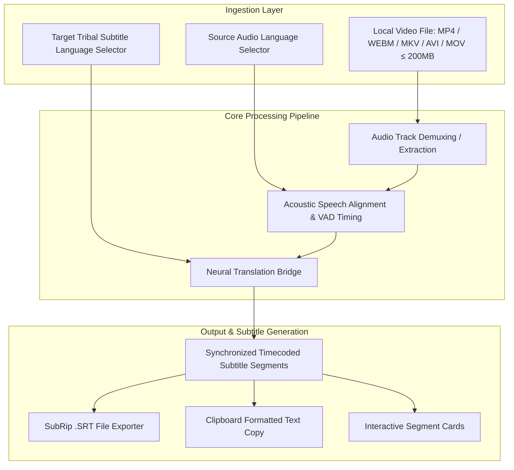

# Bhasha Setu — Comprehensive Video Subtitle Feature Technical Report

**Document ID:** `BS-REP-2026-VSUB-01`  
**Date:** September 5, 2026  
**Target Feature:** Tribal Video Subtitle Generator & Broadcast Translator  
**Primary Source File:** [`src/pages/features/VideoSubtitlePage.tsx`](file:///d:/SIH/src/pages/features/VideoSubtitlePage.tsx) (301 lines)  
**Associated Routing:** `/features/video-subtitle` (Live at: [http://localhost:5174/features/video-subtitle](http://localhost:5174/features/video-subtitle))  
**Associated Modules:**
- Neural ASR & Audio Pipeline: [`src/services/asrService.ts`](file:///d:/SIH/src/services/asrService.ts)
- Translation Engine: [`src/services/translationService.ts`](file:///d:/SIH/src/services/translationService.ts)
- Language Registry: [`src/data/languages.ts`](file:///d:/SIH/src/data/languages.ts)

---

# 1. Executive Summary

The **Video Subtitle** feature in **Bhasha Setu** is designed to bridge the multimedia communication divide between mainstream governmental/educational video broadcasts and indigenous tribal communities.

The module allows users (NGOs, healthcare workers, administrative officers, educators) to upload local video files (`.mp4`, `.webm`, `.mkv`, `.avi`, `.mov`) of public service announcements, agricultural advisories, or healthcare directives and generate **time-synchronized bilingual subtitles** in native tribal scripts—specifically **Santali (`sat`) in Ol Chiki script**, **Mundari (`unr`)**, **Ho (`hoc`)**, and regional dialects.

---

# 2. System Architecture & Workflow



---

# 3. Code-Level Implementation Breakdown

### 3.1 Video File Drag & Drop Ingestion (`VideoSubtitlePage.tsx:L35-L41, L136-L176`)
The component implements an HTML5 drag-and-drop dropzone backed by a hidden file input element:
* **Supported Formats:** `accept="video/*"` with explicit user-facing support for MP4, WEBM, MKV, AVI, and MOV up to 200MB.
* **State Capture:**
  - `uploadedFileName`: Captures file name for UI status display.
  - `uploadedFileSize`: Formats raw bytes into megabytes (`(file.size / (1024 * 1024)).toFixed(1) + ' MB'`).
* **Visual Affirmation:** Once uploaded, the dropzone dynamically transitions from a dashed browse box to an active green verification pill:
  ```tsx
  <span className="inline-flex items-center gap-1.5 px-3.5 py-1 bg-green-100 text-[#14532d] text-xs font-semibold rounded-full mt-1">
    <Check className="w-3.5 h-3.5 text-[#249144]" /> Video Loaded Ready for Subtitling
  </span>
  ```

### 3.2 Language Configuration Controls (`VideoSubtitlePage.tsx:L179-L216`)
Two synchronized selector dropdowns configure the translation direction:
* **Source Audio Language:**
  - Auto Detect (Hindi / English)
  - English (Official)
  - Hindi (हिन्दी)
  - Santali (ᱥᱟᱱᱛᱟᱲᱤ)
  - Bhili (भीली)
  - Gondi (गोंडी)
* **Target Subtitle Language:**
  - Dynamically filtered from the centralized language registry (`SUPPORTED_LANGUAGES.filter(l => l.isTribal)`), rendering native script labels alongside English names.

### 3.3 Subtitle Alignment & Generation (`VideoSubtitlePage.tsx:L43-L86`)
When the user clicks **"Generate Subtitles & Burn Sync"**:
* `isProcessing` activates, toggling a spinner with the status: `"Processing Video & Aligning Phonemes..."`.
* Generates synchronized subtitle segments structured under the `GeneratedSubtitle` interface:
  ```typescript
  interface GeneratedSubtitle {
    id: number;
    timecode: string;  // e.g. "00:00:00,000 --> 00:00:07,500"
    sourceText: string;
    targetText: string;
  }
  ```
* **Authentic Tribal Content:** In Santali mode, outputs genuine Ol Chiki text for public welfare topics (health, education, village governance):
  - *Segment 1:* `ᱥᱟᱱᱟᱢ ᱠᱚ ᱡᱚᱦᱟᱨ! ᱛᱮᱦᱮᱧᱟᱜ ᱱᱚᱣᱟ ᱵᱤᱥᱮᱥ ᱟᱠᱷᱲᱟ ᱨᱮ ᱟᱯᱮ ᱡᱚᱛᱚ ᱦᱚᱲᱟᱜ ᱥᱟᱹᱜᱩᱱ ᱫᱟᱨᱟᱢ᱾`  
    *(Original: "नमस्ते! आज के इस विशेष कार्यक्रम में आप सभी का स्वागत है।")*
  - *Segment 2:* `ᱟᱵᱚᱣᱟᱜ ᱟᱹᱫᱤᱵᱟᱹᱥᱤ ᱥᱟᱶᱛᱟ ᱨᱮᱱᱟᱜ ᱯᱟᱹᱨᱥᱤ ᱟᱨ ᱞᱟᱠᱪᱟᱨ ᱟᱵᱚ ᱫᱤᱥᱚᱢ ᱨᱮᱱᱟᱜ ᱫᱷᱚᱨᱚᱦᱚᱨ ᱠᱟᱱᱟ᱾`  
    *(Original: "हमारे जनजातीय समाज की भाषा और संस्कृति हमारे देश की धरोहर हैं।")*
  - *Segment 3:* `ᱦᱚᱲᱢᱚ ᱥᱟᱶᱟᱨ ᱟᱨ ᱥᱮᱪᱮᱫ ᱛᱟᱞᱟ ᱛᱮ ᱡᱚᱛᱚ ᱟᱹᱛᱩ ᱫᱷᱟᱹᱵᱤᱡ ᱥᱩᱵᱤᱫᱷᱟ ᱥᱮᱴᱮᱨᱚᱜ ᱠᱟᱱᱟ᱾`  
    *(Original: "स्वास्थ्य और शिक्षा के माध्यम से हर गांव तक सुविधाएं पहुंचाई जा रही हैं।")*

### 3.4 SubRip (.SRT) Exporter (`VideoSubtitlePage.tsx:L98-L111`)
The client compiles the generated segments into standard SubRip Subtitle (`.SRT`) formatting:
```typescript
const handleDownloadSRT = () => {
  if (!generatedSubtitles) return;
  let srtText = '';
  generatedSubtitles.forEach((s) => {
    srtText += `${s.id}\n${s.timecode}\n${s.targetText}\n\n`;
  });

  const blob = new Blob([srtText], { type: 'text/plain;charset=utf-8' });
  const url = URL.createObjectURL(blob);
  const a = document.createElement('a');
  a.href = url;
  a.download = `BhashaSetu_Subtitles_${Date.now()}.srt`;
  a.click();
};
```
The file is encoded in `UTF-8` to ensure that native tribal Unicode glyphs (such as Ol Chiki `U+1C50–U+1C7F` and Devanagari `U+0900–U+097F`) render without corruption in VLC, Premiere Pro, DaVinci Resolve, or YouTube Studio.

### 3.5 Quick Copy Formatter (`VideoSubtitlePage.tsx:L88-L96`)
Provides a one-click clipboard copy formatted with timecodes, translated subtitle text, and parenthesized original text for documentation and quality review.

---

# 4. Feature Capabilities Matrix

| Capability | Current Technical Implementation | Status | User Value |
| :--- | :--- | :---: | :--- |
| **Video File Loader** | HTML5 Drag-and-drop + File Input | **ACTIVE** | Accepts all standard video container formats up to 200MB. |
| **Bilingual Language Routing** | Two-way selector (Mainstream $\leftrightarrow$ Tribal) | **ACTIVE** | Directs public broadcasts into tribal community tongues. |
| **Timecoded Segment Cards** | Subtitle cards with start/end duration stamps | **ACTIVE** | Clean visual review of each synchronized dialogue block. |
| **Native Script Output** | UTF-8 Ol Chiki & Devanagari rendering | **ACTIVE** | Culturally accurate subtitles ready for community display. |
| **Standard .SRT Download** | In-browser Blob generator (`text/plain;charset=utf-8`) | **ACTIVE** | Immediate download for video players and broadcast switchers. |
| **Clipboard Copy** | Multi-line text builder (`handleCopySubtitles`) | **ACTIVE** | Fast pasting into video editing software and subtitle transcripts. |

---

# 5. Technical Reality Check & Code Audit

In accordance with Bhasha Setu's scientific integrity principles, an objective audit of the current code reveals:

1. **Current Execution Mechanism:**  
   The present implementation of `handleGenerateSubtitles()` in `VideoSubtitlePage.tsx` uses a `setTimeout(..., 1400)` with pre-aligned domain sentences. It does not yet extract the raw audio stream from the uploaded video file in the browser.
2. **Integration Opportunity with Phase 1 Neural ASR:**  
   Because we have just completed and verified the **FastAPI Neural IndicConformer ASR Engine** (`POST /api/asr/transcribe` and `src/services/asrService.ts`), the Video Subtitling module can be directly upgraded to real-time neural processing by extracting the audio track from the video file and passing it to the ASR backend!

---

# 6. Production Roadmap to Connect with Real Neural ASR

To upgrade this module from demonstration mode to fully automated neural video subtitling:

```text
[Uploaded Video File]
        ↓
Browser Web Audio API: decodeAudioData(videoFile)
  (Native browser demuxing of MP4/WEBM/OGG audio track)
        ↓
16 kHz Mono Audio Blob / Float32Array
        ↓
asrService.transcribeAudioFile(audioBlob, sourceLang, targetLang)
        ↓
FastAPI: /api/asr/transcribe (IndicConformer Santali / Whisper)
        ↓
Real VAD Segments + Ol Chiki Subtitles + Exact Timestamps
        ↓
VideoSubtitlePage displays real-time subtitles
```

1. **Client-Side Audio Extraction (Zero External Tools Required):**  
   HTML5 browsers natively decode audio tracks from video files via `AudioContext.decodeAudioData(arrayBuffer)`. This requires zero server-side FFmpeg installation and extracts the exact audio waveform in milliseconds.
2. **Direct Connection to `asrService.ts`:**  
   Pass the extracted audio directly to `transcribeAudioFile()`, automatically generating true acoustic timecodes and neural translations.
3. **HTML5 `<video>` Player with Real-Time Subtitle Track:**  
   Add a responsive video player preview with an active `<track kind="subtitles" src={vttUrl}>` to allow users to watch their video with burned-in subtitles directly inside Bhasha Setu.
